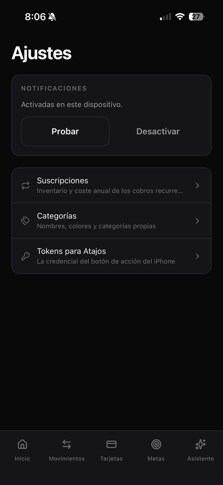
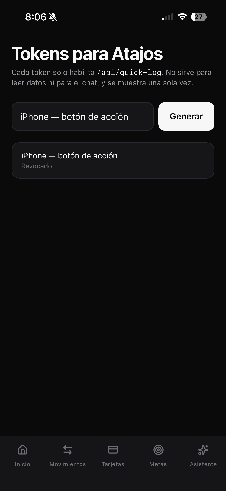
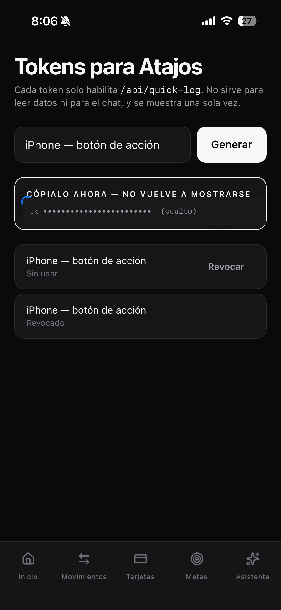
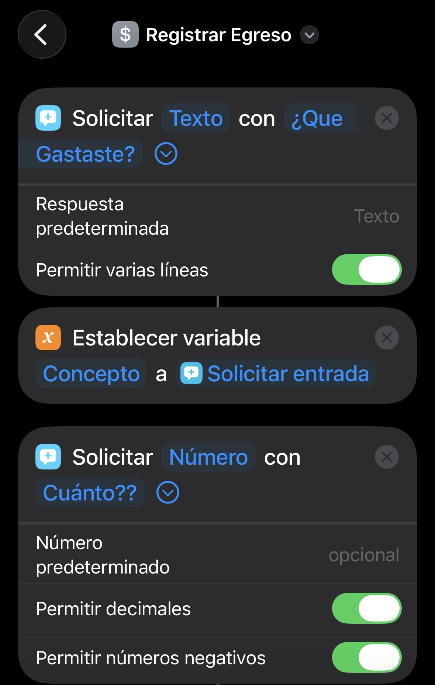
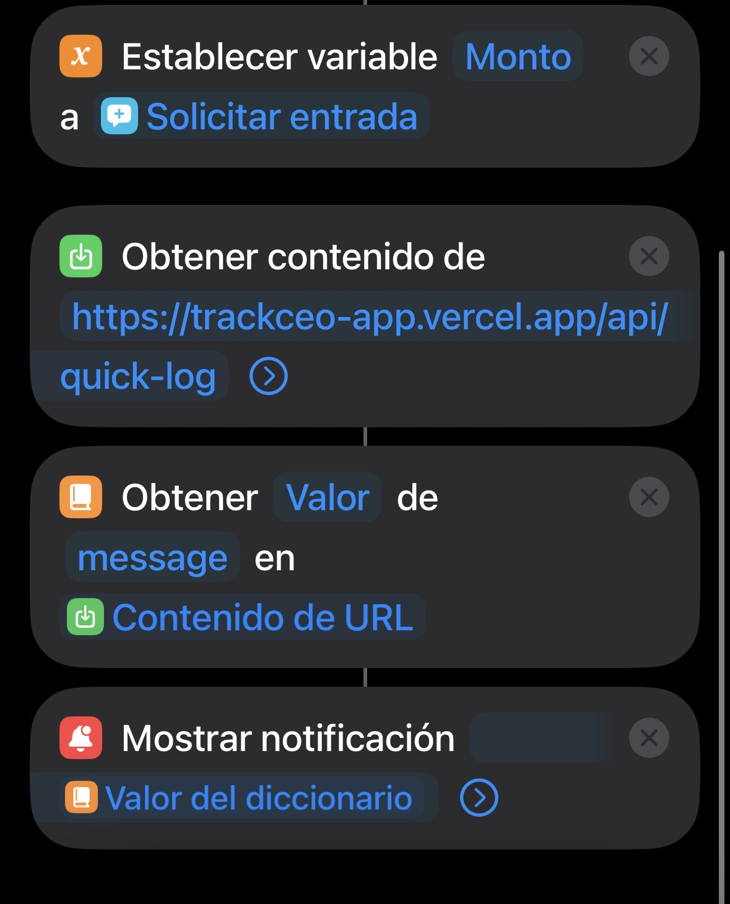
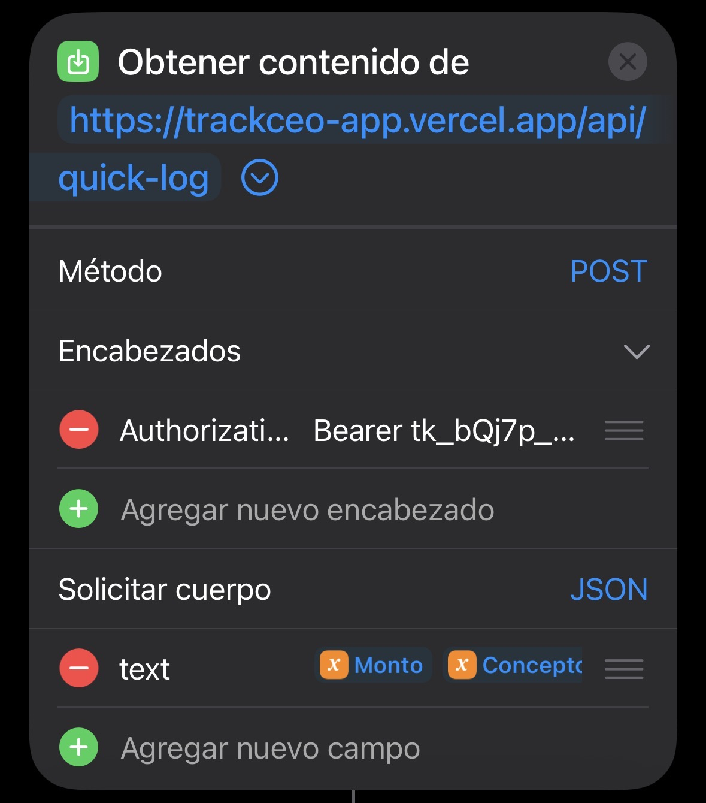

<h1 align="center">TrackApp</h1>

<p align="center">
  Finanzas personales para quienes odian llevar cuentas.<br>
  <strong>Menos de 5 segundos</strong> desde el botón de acción del iPhone hasta la transacción guardada, sin abrir la app.
</p>

<p align="center">
  
  
  
  
  
</p>

---

## Contenido

- [Qué es](#qué-es)
- [Principios no negociables](#principios-no-negociables)
- [Stack](#stack)
- [Puesta en marcha](#puesta-en-marcha)
- [Variables de entorno](#variables-de-entorno)
- [Comandos](#comandos)
- [Despliegue en Vercel](#despliegue-en-vercel)
- [Instalar en el iPhone](#instalar-en-el-iphone)
- [Configurar el atajo de iOS](#configurar-el-atajo-de-ios)
- [Arquitectura en un vistazo](#arquitectura-en-un-vistazo)
- [Estado](#estado)

---

## Qué es

Una app de finanzas personales construida alrededor de una sola hipótesis: **la
gente no deja de registrar sus gastos por falta de voluntad, sino por fricción**.
Si registrar un gasto cuesta abrir una app, buscar un botón y rellenar cuatro
campos, no se hace.

Por eso la ruta principal del producto no pasa por la interfaz. Pasa por el
botón de acción del iPhone: se pulsa, se dicta _«almuerzo, 25 mil»_, y aparece
una notificación confirmando el registro. La app existe para consultar y
corregir, no para capturar.

Todo lo demás —el panel, los gráficos, las metas, el asistente— está subordinado
a que ese camino siga siendo instantáneo.

## Principios no negociables

Estas reglas mandan sobre cualquier preferencia de estilo. Si un cambio las
contradice, el cambio está mal.

| #   | Regla                                                            | Por qué                                                                                                                         |
| --- | ---------------------------------------------------------------- | ------------------------------------------------------------------------------------------------------------------------------- |
| 1   | **Dinero en enteros.** `Int` en la unidad mínima, nunca `Float`. | El punto flotante pierde centavos y los pierde en silencio.                                                                     |
| 2   | **`userId` en toda query**, aunque hoy haya un solo usuario.     | En las herramientas de IA el `userId` sale de la sesión, **jamás** de los argumentos que genera el modelo.                      |
| 3   | **La IA no es crítica.**                                         | Si Groq falla, la app registra transacciones igual. Todo camino que dependa de un LLM tiene un fallback determinista.           |
| 4   | **Node.js runtime** por defecto en los Route Handlers.           | Prisma y `web-push` necesitan APIs de Node.                                                                                     |
| 5   | **`actions/` vs `api/`.**                                        | Si el consumidor es la propia UI, Server Action. Si es externo (Atajos) o necesita streaming (chat), Route Handler.             |
| 6   | **Sistema monocromo.** Sin color acento.                         | La jerarquía la dan tipografía, luminancia y espacio. Todo token vive en `app/globals.css`; si un color no está ahí, no existe. |
| 7   | **Solo se animan `transform` y `opacity`.**                      | Cualquier otra propiedad pasa por layout o paint y compite con la ruta del registro rápido.                                     |

La guía visual completa está en [`CLAUDE.md`](CLAUDE.md); el detalle de
arquitectura, en [`TrackApp-Tecnico.md`](TrackApp-Tecnico.md).

## Stack

**Next.js 16** (App Router) · **TypeScript** · **Tailwind v4** · **Prisma 7 +
PostgreSQL** (Neon) · **Auth.js v5** (JWT) · **Groq** · **Recharts** ·
**Web Push** · **pnpm**

Un solo despliegue: Next.js sirve el frontend y la API. No hay backend separado.

## Puesta en marcha

```bash
pnpm install
cp .env.example .env.local     # rellenar las variables
pnpm db:migrate                # crea el schema en Neon
pnpm db:seed                   # categorías base + usuario inicial
pnpm dev
```

Opcionalmente, `pnpm db:demo` carga movimientos de ejemplo para ver el panel con
forma (`pnpm db:demo:clear` los borra).

Generar secretos:

```bash
openssl rand -base64 32   # AUTH_SECRET
openssl rand -hex 32      # CRON_SECRET
```

## Variables de entorno

Neon expone **dos** cadenas de conexión y las dos hacen falta: `DATABASE_URL`
(pooled, la usa la app en runtime vía el driver adapter de Prisma 7) y
`DIRECT_URL` (directa, la usa la CLI para migrar). Prisma 7 ya no acepta `url`
dentro de `datasource`: viven en [`prisma.config.ts`](prisma.config.ts).

| Variable                                                                   | Necesaria              | Notas                                                                                                               |
| -------------------------------------------------------------------------- | ---------------------- | ------------------------------------------------------------------------------------------------------------------- |
| `DATABASE_URL`                                                             | **Sí** — runtime       | Cadena _pooled_ de Neon (host con `-pooler`).                                                                       |
| `DIRECT_URL`                                                               | **Sí** — build         | Cadena directa. Sin ella `prisma generate` falla y el build se cae antes de compilar.                               |
| `AUTH_SECRET`                                                              | **Sí**                 | La lee Auth.js.                                                                                                     |
| `CRON_SECRET`                                                              | **Sí** en producción   | Vercel lo manda como `Authorization: Bearer <valor>` a los endpoints de cron.                                       |
| `GROQ_API_KEY`                                                             | Opcional               | Sin ella el chat se apaga y el parser se queda en su nivel determinista. Registrar transacciones sigue funcionando. |
| `GROQ_MODEL_CHAT`<br>`GROQ_MODEL_FAST`                                     | Opcional               | Groq retira modelos sin aviso. Si el chat empieza a devolver 404, se sobreescribe aquí sin tocar código.            |
| `CLOUDINARY_CLOUD_NAME`<br>`CLOUDINARY_API_KEY`<br>`CLOUDINARY_API_SECRET` | Para imágenes de metas | La firma se hace en el servidor; el navegador nunca ve el secreto.                                                  |
| `NEXT_PUBLIC_VAPID_PUBLIC_KEY`<br>`VAPID_PRIVATE_KEY`<br>`VAPID_SUBJECT`   | Para push              | Sin la pública, `pushEnabled()` devuelve `false` y las notificaciones quedan apagadas en silencio.                  |
| `SEED_USER_*`                                                              | Solo local             | Las usa `pnpm db:seed`. No van a producción.                                                                        |

> **Las variables `NEXT_PUBLIC_*` se hornean en el bundle durante el build.**
> Cambiarlas después de un despliegue no surte efecto hasta redesplegar.

## Comandos

| Comando              | Qué hace                                   |
| -------------------- | ------------------------------------------ |
| `pnpm dev`           | Servidor de desarrollo                     |
| `pnpm build`         | `prisma generate && next build`            |
| `pnpm typecheck`     | `tsc --noEmit`                             |
| `pnpm lint`          | ESLint                                     |
| `pnpm format`        | Prettier                                   |
| `pnpm db:migrate`    | Migración de desarrollo                    |
| `pnpm db:deploy`     | Aplica migraciones pendientes (producción) |
| `pnpm db:seed`       | Categorías base y usuario inicial          |
| `pnpm db:demo`       | Movimientos de ejemplo                     |
| `pnpm db:demo:clear` | Borra las transacciones del usuario        |
| `pnpm db:studio`     | Explorador de la base                      |

## Despliegue en Vercel

1. **Importar el repo** en [vercel.com/new](https://vercel.com/new). El framework
   se autodetecta y `pnpm` sale del lockfile.
2. **No sobreescribir el Build Command.** Vercel usa el script `build` del
   `package.json`, que ya es `prisma generate && next build`.
3. **Cargar las variables antes del primer despliegue**, porque las
   `NEXT_PUBLIC_*` se hornean en el build.
4. Desplegar. A partir de ahí cada push a `main` va a producción y cada PR genera
   un preview.

**No configures `AUTH_URL` ni `AUTH_TRUST_HOST`.** En Auth.js v5 el host se
infiere de las cabeceras y Vercel se detecta solo; copiar el `AUTH_URL` local
—que apunta a `localhost`— rompe el login en producción.

**Las migraciones no corren solas.** El build solo hace `prisma generate`. Cuando
crees una migración nueva, aplícala con `pnpm db:deploy` contra Neon.

Los tres cron jobs viven en [`vercel.json`](vercel.json) y son diarios, que es lo
máximo que permite el plan Hobby. Las horas son **UTC**, y en Hobby Vercel puede
dispararlos en cualquier momento dentro de la hora indicada.

## Instalar en el iPhone

Los iconos y el manifest están listos, pero **iOS solo permite añadir a la
pantalla de inicio desde HTTPS**: `localhost` no sirve desde el teléfono. Hay que
desplegar antes de este paso.

1. Abrir la URL en **Safari** (Chrome en iOS no ofrece la opción).
2. Compartir → **Añadir a pantalla de inicio**.

Sin este paso **no hay notificaciones push en iOS**, así que todo el sistema de
alertas queda inutilizado.

Para regenerar los iconos si cambia la marca, la fuente vectorial está en
`public/icons/icon.svg` y `public/icons/maskable.svg`.

## Configurar el atajo de iOS

Es la ruta principal del producto, no un extra. Se configura una vez y son dos
partes: generar la credencial en la app, y montar el atajo en el iPhone.

### Parte 1 — Generar el token

<table>
  <tr>
    <td align="center" width="33%">
      
    </td>
    <td align="center" width="33%">
      
    </td>
    <td align="center" width="33%">
      
    </td>
  </tr>
  <tr>
    <td align="center"><sub><b>1.</b> Ajustes → <b>Tokens para Atajos</b></sub></td>
    <td align="center"><sub><b>2.</b> Nombrar el token y pulsar <b>Generar</b></sub></td>
    <td align="center"><sub><b>3.</b> Copiarlo — <b>no vuelve a mostrarse</b></sub></td>
  </tr>
</table>

En la base solo vive el hash SHA-256 del token, nunca el token. Si se pierde, se
genera otro y se revoca el viejo desde esa misma pantalla, que muestra el último
uso de cada uno.

Cada token habilita **únicamente** `POST /api/quick-log`. No sirve para leer
datos ni para el chat.

> Antes de compartir capturas de esta pantalla, tapa el token o revócalo.

### Parte 2 — Verificar el endpoint

Merece la pena antes de tocar el iPhone: si esto falla, el problema es el token
o el servidor; si esto funciona y el atajo no, el problema es el atajo.

```bash
curl -X POST https://TU-DOMINIO.vercel.app/api/quick-log \
  -H "Authorization: Bearer tk_TU_TOKEN" \
  -H "Content-Type: application/json" \
  -d '{"text":"25000 almuerzo"}'
```

```json
{ "ok": true, "message": "Registrado: almuerzo — $ 25.000", "transactionId": "..." }
```

### Parte 3 — Montar el atajo

El atajo pregunta el concepto y el monto por separado, y los une en un solo campo
`text`.

<table>
  <tr>
    <td align="center" width="33%">
      
    </td>
    <td align="center" width="33%">
      
    </td>
    <td align="center" width="33%">
      
    </td>
  </tr>
  <tr>
    <td align="center"><sub><b>4.</b> Acciones 1–3: preguntar y guardar el concepto</sub></td>
    <td align="center"><sub><b>5.</b> Acciones 4–7: llamada, lectura y notificación</sub></td>
    <td align="center"><sub><b>6.</b> Detalle de la llamada: método, cabecera y cuerpo</sub></td>
  </tr>
</table>

Las siete acciones, en orden:

| #   | Acción                        | Configuración                         |
| --- | ----------------------------- | ------------------------------------- |
| 1   | Solicitar entrada             | Tipo `Texto` · «¿Qué gastaste?»       |
| 2   | Establecer variable           | `Concepto` ← `Entrada proporcionada`  |
| 3   | Solicitar entrada             | Tipo `Número` · «¿Cuánto?»            |
| 4   | Establecer variable           | `Monto` ← `Entrada proporcionada`     |
| 5   | Obtener contenido de URL      | `POST /api/quick-log` — ver abajo     |
| 6   | Obtener valor del diccionario | clave `message` en `Contenido de URL` |
| 7   | Mostrar notificación          | `Valor del diccionario`               |

Configuración de la acción 5:

- **URL** — `https://TU-DOMINIO.vercel.app/api/quick-log`
- **Método** — `POST`
- **Encabezado** — `Authorization` = `Bearer tk_...` &nbsp;_(la palabra `Bearer` y un espacio son obligatorios)_
- **Solicitar cuerpo** — `JSON`
- **Campo** — clave `text`, tipo Texto, valor = `[Monto]` espacio `[Concepto]`

Por último, se asigna en **Ajustes → Botón de Acción → Atajo**.

> **El monto va primero, y no es un detalle cosmético.** El parser toma **el
> primer número** que encuentra en la cadena. Con el concepto delante, un gasto
> como «taxi 2 personas» + `25000` se registra como **$2**, porque el `2` aparece
> antes. Con el monto delante el parseo es correcto en todos los casos.

### Variantes

**Registrar un ingreso.** Duplicar el atajo y añadir un segundo campo al cuerpo
JSON: clave `type`, valor `INCOME`. Si se omite, el backend asume `EXPENSE`.

**Una sola pregunta.** Sustituir las acciones 1–4 por una sola _Solicitar
entrada_ de tipo Texto y pasarla directamente como `text`. El parser entiende
`25 mil`, `25k`, `180.500` y `1.5 millones`, y permite dictar la frase completa.

**Consultar el balance.** Dos acciones: `GET /api/quick-log/summary` con la misma
cabecera, y _Mostrar notificación_ con `message`.

### Si algo falla

| Notificación            | Causa                                                                              |
| ----------------------- | ---------------------------------------------------------------------------------- |
| _No autorizado_         | Falta `Bearer ` delante del token, o el token está revocado                        |
| _Formato inválido_      | La clave del cuerpo JSON no es `text`                                              |
| _No entendí el monto_   | El campo `text` no lleva la variable del monto, o falta el espacio entre variables |
| _Demasiadas peticiones_ | Límite de 20 registros por minuto                                                  |
| No aparece nada         | La acción 7 quedó vacía o con texto en vez de la variable                          |

El campo `message` viene listo para mostrarse tal cual, también en los errores:
toda la lógica de presentación vive en el backend, así que mejorar los mensajes
no obliga a reconfigurar el atajo en el teléfono.

## Arquitectura en un vistazo

```
src/
├── app/
│   ├── (auth)/login          Auth.js v5, credenciales
│   ├── (dashboard)/          Panel, movimientos, tarjetas, metas, chat, ajustes
│   └── api/
│       ├── quick-log/        ← Ruta principal: el atajo de iOS (API Key)
│       ├── chat/             Streaming + function calling
│       └── cron/             Recurrentes, alertas, retención del chat
├── actions/                  Server Actions: todo lo que consume la propia UI
├── services/
│   ├── ai/                   Parser determinista + fallback a Groq
│   ├── finance/              Balance, agregaciones, crédito, metas, recurrentes
│   └── notifications/        Web Push
├── components/ui/            Primitivas: Money, Card, Panel, Sheet, Skeleton…
└── lib/                      Prisma, auth, dinero, fechas, validación
```

El atajo de iOS es el único cliente que no usa sesión de navegador: entra por su
propio carril con autenticación por API Key.

## Estado

El MVP está **completo y verificado contra la base real**: alta manual de
movimientos, metas con imagen, asistente con streaming y function calling,
historial de conversaciones con retención de 30 días, tarjetas con simuladores de
cuotas y pago mínimo, suscripciones con coste anualizado, service worker con cola
offline y Web Push de punta a punta.

Lo que queda no es código:

- **Verificar la entrega real de una notificación push** en un dispositivo real.
  Toda la cadena está comprobada salvo el último salto, que necesita un teléfono.
- **Usar el atajo durante una semana.** Es la validación que el documento técnico
  pide antes de seguir construyendo, y sigue pendiente.

El detalle completo está en **[TASKS.md](TASKS.md)**.

## Documentación

| Documento                                          | Contenido                                     |
| -------------------------------------------------- | --------------------------------------------- |
| [`Track-App-noTecnico.md`](Track-App-noTecnico.md) | Visión, alcance y prioridades de producto     |
| [`TrackApp-Tecnico.md`](TrackApp-Tecnico.md)       | Arquitectura, schema y contratos del MVP      |
| [`TASKS.md`](TASKS.md)                             | Estado detallado: qué está hecho y qué falta  |
| [`CLAUDE.md`](CLAUDE.md)                           | Guía visual y reglas para trabajar en el repo |
